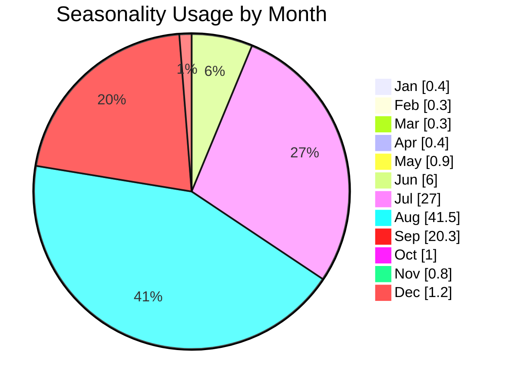

# Route Profile: Casual Route

(photo banner, area/grade/FA info, etc.)

Summary

Your prose: history, cultural importance, climbing experience.

Route Characteristics

Bullets, anecdotes, formation details.

Analysis

Any narrative insights you want to keep hand-written.


<!-- AUTO:METRICS:START -->
### Metrics

| Metric              | Value     |
|:--------------------|:----------|
| Classic Rank         |           |
| Grade                | 5.10a YDS |
| Location             | Diamond   |
| Stars (avg)          | 3.8       |
| Votes                | 668.0     |
| Unique Climbers      | 1094.0    |
| Lifetime Ticks       | 1419.0    |
| Avg Ticks / Climber  | 1.30      |
<!-- AUTO:METRICS:END -->

<!-- AUTO:SEASONALITY:START -->
### Seasonality

#### Meteorological Seasons
- ❄️ **Winter (Dec–Feb)**: 1.9% **off season**
- 🌸 **Spring (Mar–May)**: 1.6% **off season**
- ☀️ **Summer (Jun–Aug)**: 74.5% **high season**
- 🍂 **Fall (Sep–Nov)**: 22.0%

### Seasonality Usage by Month


<details>
<summary>Text fallback (expand if the chart doesn't render)</summary>

```
Jan | █                              0.4%
Feb | █                              0.3%
Mar | █                              0.3%
Apr | █                              0.4%
May | █                              0.9%
Jun | ██                             6.0%
Jul | ████████                      27.0%
Aug | ████████████                  41.5%
Sep | ██████                        20.3%
Oct | █                              1.0%
Nov | █                              0.8%
Dec | █                              1.2%
```
</details>
<!-- AUTO:SEASONALITY:END -->

<!-- AUTO:TOP_CLIMBERS:START -->
### Leaderboards

| Rank | Climber | Ticks |
|-----:|:--------|------:|
| 1 | Stefan Griebel:16 | 16 |
| 2 | John Alcorn:12 | 12 |
| 3 | WadeM:12 | 12 |
| 4 | Will Starks:8 | 8 |
| 5 | Charles Vernon:6 | 6 |
| 6 | Jason Antin:6 | 6 |
| 7 | Japhy Dhungana:5 | 5 |
| 8 | Mike Lewis:5 | 5 |
| 9 | Sarah Malone:5 | 5 |
| 10 | Tim Hare:5 | 5 |
<!-- AUTO:TOP_CLIMBERS:END -->
